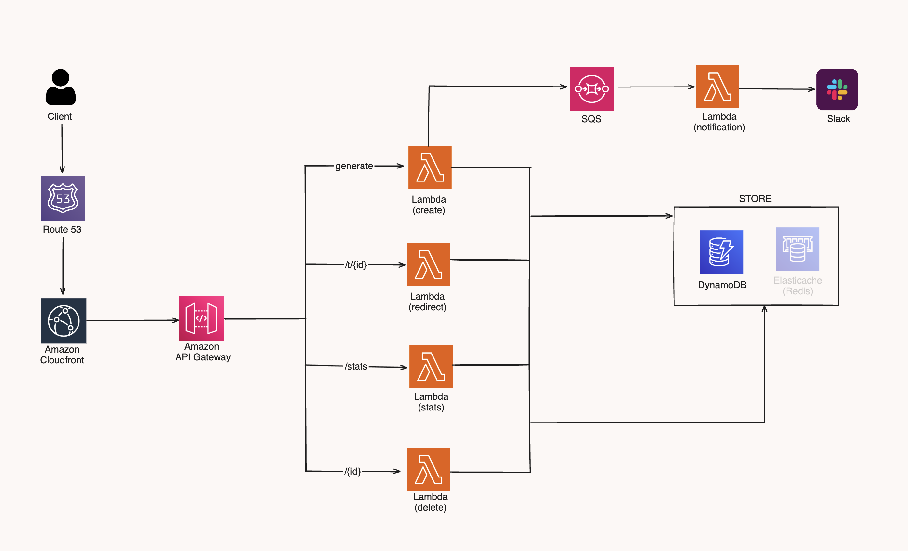

# Golang URL Shortener

This URL shortening service, based on Go and Hexagonal architecture, uses a serverless approach for efficient scalability and performance. It leverages various AWS services to provide a reliable, maintainable, and highly available URL shortening service.

- [System Architecture](#system-architecture)
- [Class Diagram](#class-diagram)
- [Installation](#installation)
- [Usage](#usage)
  - [Deploying to AWS Lambda](#deploying-to-aws-lambda)
  - [Running Tests](#running-tests)
  - [Cleaning Up](#cleaning-up)
- [Hexagonal Architecture](#hexagonal-architecture)
- [Technologies Used](#technologies-used)

## System Architecture



## Class Diagram

| LINK         |        |    |        |    | STATS        |        |
| :----------- | -----: | -: | :----: | :- | :----------- | -----: |
| id (PK)      | string |    |        |    | id (PK)      | string |
| original_url | string | 1  | &rarr; | n  | platform     | int    |
| created_at   | Date   |    |        |    | original_url | string |
|              |        |    |        |    | created_at   | Date   |

## Installation

**Clone the repository and build the project**:

```sh
git clone https://github.com/pchchv/go-url-shortener.git
cd go-url-shortener
make build
```

## Usage

### Deploying to AWS Lambda

- Deploy functions to AWS Lambda using:
  ```sh
  make deploy
  ```
  This command will use AWS SAM to deploy serverless functions.

### Running Tests

- **Unit Tests**: Run unit tests for specific functions:

  ```sh
  make unit-test
  ```

- **Benchmark Tests**: Perform benchmark tests:
  ```sh
  make benchmark-test
  ```

### Cleaning Up

- To clean up the build artifacts:

  ```sh
  make clean
  ```

- To delete the deployed stack:
  ```sh
  make delete
  ```

## Hexagonal Architecture

Hexagonal architecture in a serverless context, specifically using Go language, combines modern architectural patterns with the agility and scalability of serverless computing.

**Core Concept** of hexagonal architecture, also known as ports and adapters architecture, is designed to create a loosely coupled application that isolates the core logic from external concerns. The idea is to allow the application to be equally driven by users, programs, automated tests or batch scripts, and to be developed and tested in isolation from the devices and databases on which it will later run.

**Ports** are interfaces that define how data can enter and leave the application or system.
**Adapters** are implementations that interact with the outside world, such as a database, a web server, or other systems.

To learn more, go to the [AWS blog](https://aws.amazon.com/blogs/compute/developing-evolutionary-architecture-with-aws-lambda).

## Technologies Used

- **Go (Golang)**: The primary programming language used for development.
- **AWS DynamoDB**: A NoSQL database service used for storing and retrieving data efficiently.
- **ElastiCache(Redis)**: An in-memory data structure store, used as a cache and message broker.
- **AWS CloudFormation**: A service for defining and deploying infrastructure as code, ensuring consistent and repeatable architectural deployments.
- **AWS SQS (Simple Queue Service)**: A message queuing service used to decouple and scale microservices, distributed systems, and serverless applications.
- **GitHub Actions**: Automated CI/CD platform used for building, testing, and deploying code directly from GitHub repositories.
- **AWS Lambda**: A serverless compute service that lets you run code without provisioning or managing servers, automatically scaling with usage.
- **AWS CloudFront**: A fast content delivery network (CDN) service that securely delivers data, videos, applications, and APIs to customers globally with low latency and high transfer speeds.
- **AWS API Gateway**: A fully managed service that makes it easy for developers to create, publish, maintain, monitor, and secure APIs at any scale.
